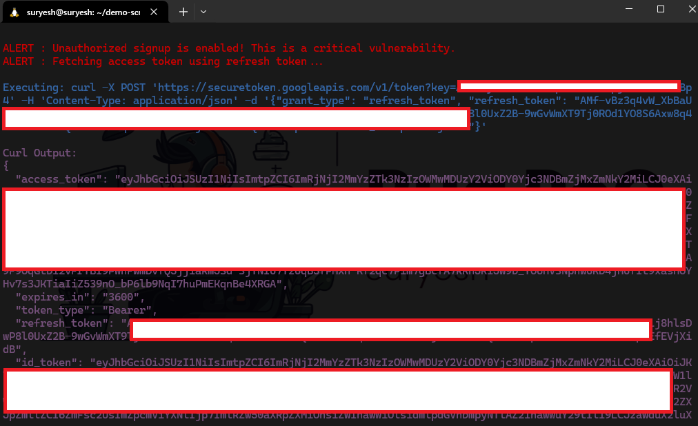
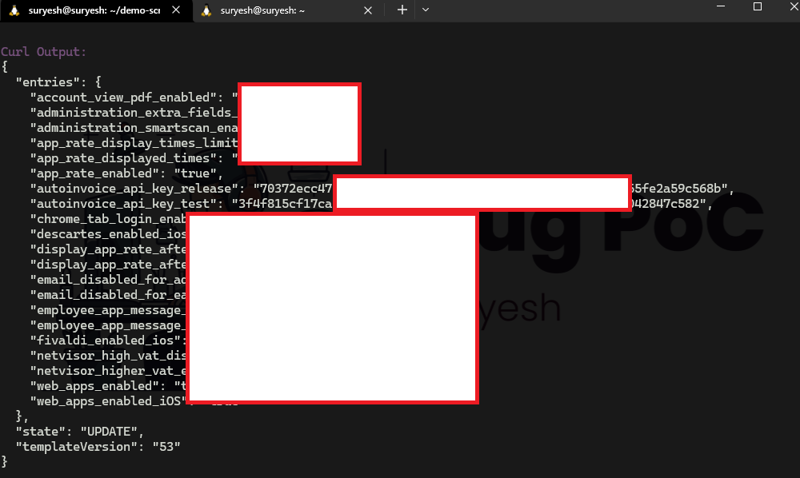

# Firebase_Checker

A Firebase Checker is powerful Python tool to analyze APK files for Firebase-related vulnerabilities, such as open Firebase databases, unauthorized Firebase signup, and Firebase Remote Config misconfigurations. This tool is designed for security researchers, developers, and penetration testers to identify potential security risks in Android applications that use Firebase.

# Features

- **Extract Firebase Details:** Automatically extracts Firebase App ID, Firebase URL, and Google API Key from APK files.
- **Check for Open Firebase Databases:** Detects if the Firebase database is publicly accessible.
- **Unauthorized Signup Check:** Tests if unauthorized Firebase signup is possible using the extracted Google API Key.
- **Firebase Remote Config Check:** Identifies if Firebase Remote Config is enabled and accessible.
- **Interactive Interface:** Supports tab completion for file paths, making it easy to use.
- **Detailed Reporting:** Provides clear and colored output for vulnerability results.

# Installation

## Prerequisites

Python 3.x

`requests` library (`pip install requests`)

`termcolor` library (`pip install termcolor`)

## Steps

1. Clone this Repository

```
git clone https://github.com/Suryesh/Firebase_Checker.git && cd Firebase_Checker
```

2. Install the required dependencies:

```
pip install -r requirements.txt
```

3. Now give Executable permission

```
chmod +x firebase-remote-extract_and_account_creation.py
```

# Basic Usages

1. Check help for usages

```
python3 firebase-remote-extract_and_account_creation.py -h
```
2. Run the script:

```
python3 firebase-remote-extract_and_account_creation.py
```

3. Enter the path to the APK file or folder containing APKs when prompted:

```
Enter the path to the APK file or folder containing APKs: /path/to/apk/file.apk
```

4. Now the tool will analyze the APK and display the results.

# PoC - 1

### Help


### APK file path


### Vulnerability Checking


### Detected remote Config misconfiguration


### Signup Enable for Unauthorized user


### Fetching Register User Information


### Generating Access Token


### Vulnerability Detected


# PoC - 2





# PoC -3

### API Key in Remote Config file




## License
This project is licensed under the MIT License. See the [](https://opensource.org/licenses/MIT) file for details.

## Disclaimer
This tool is intended for educational and ethical testing purposes only. Do not use it for any illegal or unauthorized activities. The author is not responsible for any misuse of this tool.
